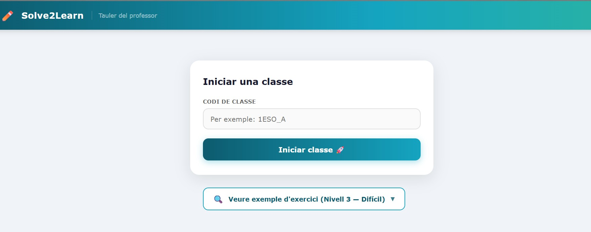
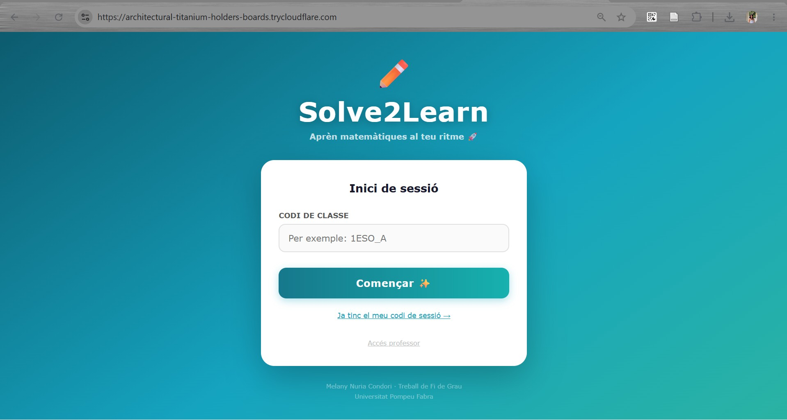
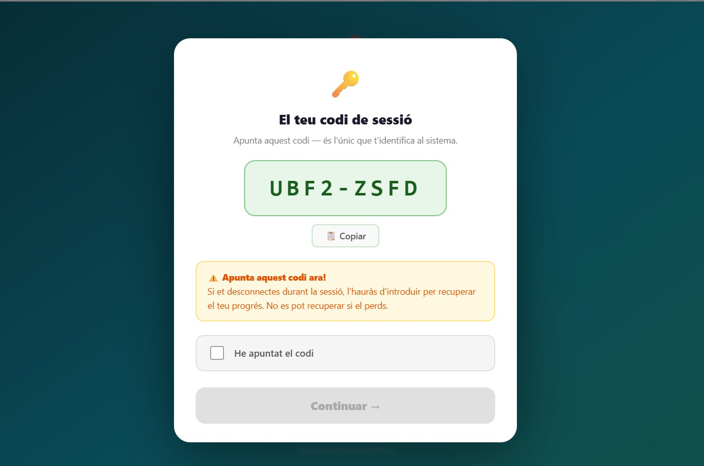
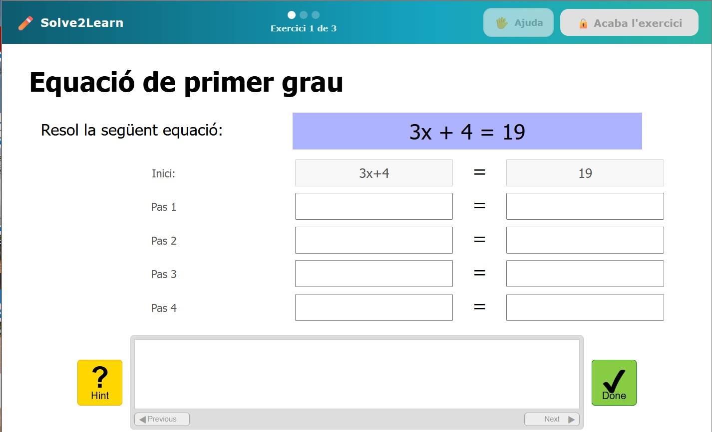
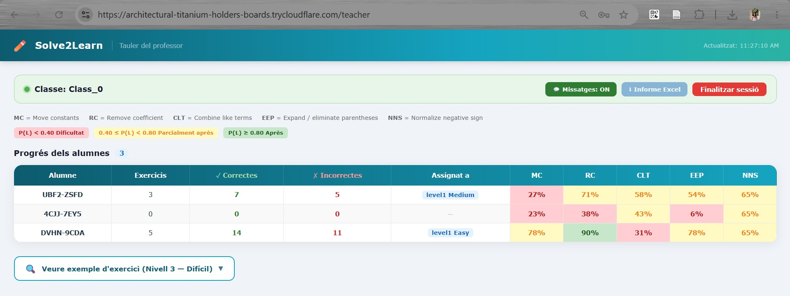
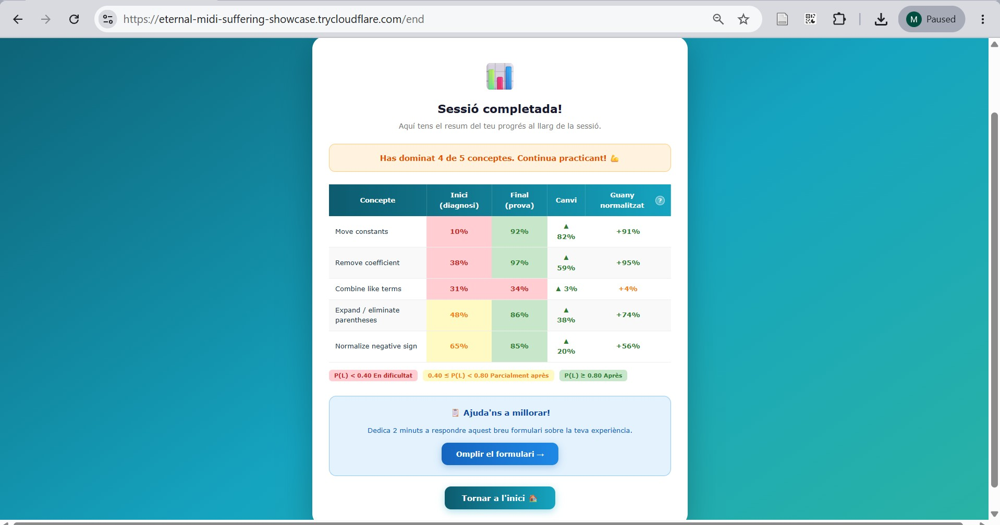
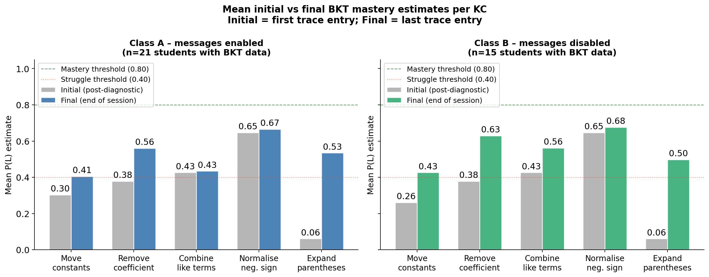

# Solve2Learn

**An adaptive tutoring system for first-year secondary school algebra — built as a Bachelor's thesis at Universitat Pompeu Fabra.**

The idea is simple: not every student struggles with the same thing. Some kids freeze when they see parentheses. Others are fine with that but completely fall apart when there's a coefficient to remove. Solve2Learn tries to figure out where each student is and give them exercises that actually match their level — not too easy to be boring, not so hard they just give up.

<p align="center">
  
</p>

---

## What it actually does

A teacher opens a class session from the dashboard. Students join with a class code and immediately start three diagnostic exercises that cover the hardest variants of each algebra level. While they work, the system is running **Bayesian Knowledge Tracing** in the background — estimating, for each student, how well they've grasped five specific algebra skills:

- Moving constants to one side
- Removing a coefficient (dividing both sides)
- Combining like terms
- Expanding and eliminating parentheses
- Normalising a negative sign

<table>
<tr>
<td align="center" width="50%">
  
  <sub>Teacher opens a session with a class code</sub>
</td>
<td align="center" width="50%">
  
  <sub>Student joins by entering the class code</sub>
</td>
</tr>
</table>

Each student is assigned a random anonymous token on arrival — no names, no logins. They note it down; if they lose connection, they use it to rejoin and pick up exactly where they left off.

<p align="center">
  
</p>

Students immediately work through three diagnostic exercises. Every step they submit is fed into the BKT engine in real time:

<p align="center">
  
</p>

Once the diagnostics are done, each student gets a personalised batch of exercises at their own level and difficulty. The teacher's dashboard updates every five seconds showing everyone's progress, knowledge states per skill, and who has raised their hand asking for help.

<p align="center">
  
</p>

When the teacher ends the session, every student sees their results: initial vs. final knowledge state per skill, how much they improved, and a normalised learning gain that makes progress comparable across students who started at very different places.

<p align="center">
  
</p>

---

## Stack

| Layer | Tech |
|---|---|
| Backend | Python 3.11 · FastAPI · SQLite (one DB per student, one per class) |
| Frontend | React 18 · TypeScript · Vite |
| Exercises | CTAT (Cognitive Tutor Authoring Tools) — HTML-based, embedded via iframe |
| BKT | Custom implementation, parameters fitted on a real student dataset |
| Tunnel | Cloudflare Tunnel (for classroom deployment without a server) |

---

## Project structure

```
adaptive_bayesian_its/
├── backend_fastAPI/
│   └── app/
│       ├── main.py              ← the entire backend (FastAPI routes + BKT logic)
│       └── data/
│           ├── app.db           ← registry of active classes/sessions
│           └── classes/         ← one folder per class session, one .db per student
├── frontend_react/
│   ├── src/
│   │   ├── pages/               ← StartSession, Tutor, Waiting, End, Teacher
│   │   └── api/                 ← typed wrappers around every backend endpoint
│   └── public/
│       └── CTAT/                ← exercise folders (level1–3 × Easy/Medium/Difficult)
└── .venv-pybkt/                 ← Python virtual environment (not committed)
```

---

## Running it locally

**Backend**

```bash
cd backend_fastAPI
pip install -r requirements.txt      # or: pip install fastapi uvicorn openpyxl
uvicorn app.main:app --reload --port 8000
```

**Frontend**

```bash
cd frontend_react
npm install
npm run dev        # dev server on http://localhost:5173
```

The frontend dev server proxies API calls to `localhost:8000` automatically. Open the app, go to `/teacher` (password: `Solve2Learn`) to start a class, then open a new tab and join as a student.

---

## Anonymisation

No personal data is ever collected. When a student starts a session, their browser generates a random 8-character token (`XXXX-XXXX` format) which is the only identifier used throughout. The token is shown once — the student writes it down — and after that there is no way to link it back to a real person. If they lose connection mid-session, they can rejoin using the same token and pick up exactly where they left off.

---

## The BKT parameters

The five knowledge components were modelled using a standard four-parameter BKT model (initial knowledge, learning rate, slip, guess). Parameters were estimated from a dataset of real student interactions collected during prior algebra sessions. Each KC has its own parameters because, empirically, they behave very differently — for instance, `expand_eliminate_parentheses` starts at near-zero prior knowledge but has a fast learning rate, while `normalize_negative_sign` starts high but slips a lot.

The chart below shows mean initial vs. final BKT mastery estimates across two pilot classes (n = 36 students):

<p align="center">
  
</p>

---

## Data and privacy

The `backend_fastAPI/app/data/classes/` folder contains one subfolder per class session. Real classroom data (from the pilot with actual students) is **not included** in this repository. What you will find is one example trial session (`c1_17h59_20-05-2026`) that contains test data generated during development.

---

## Author

Melany Nuria Condori  
Treball de Fi de Grau — Universitat Pompeu Fabra, 2026  
